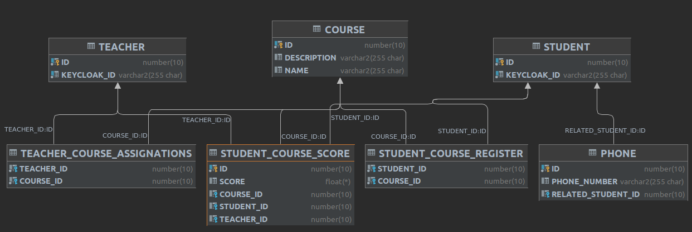
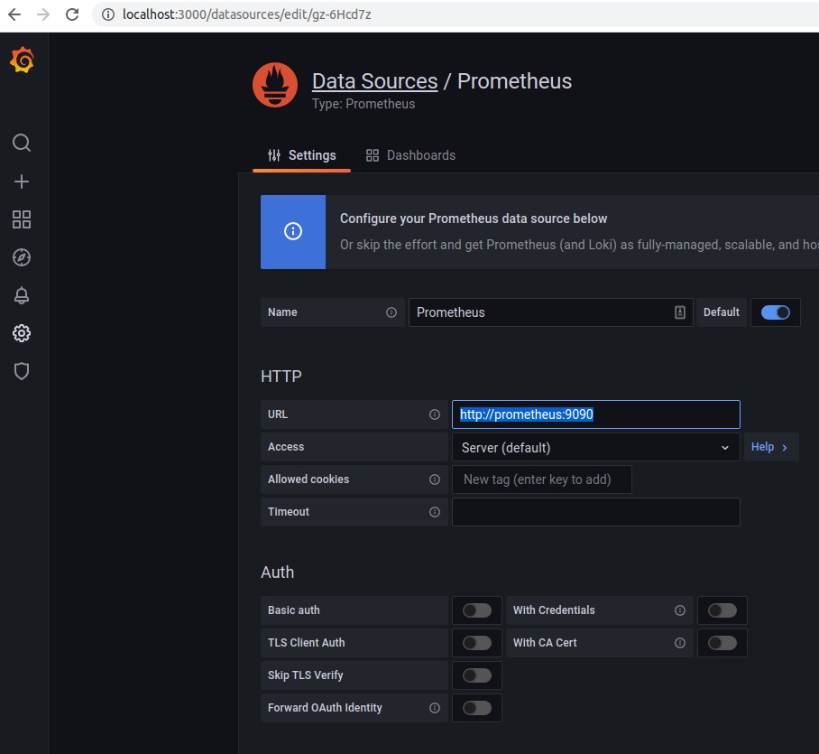
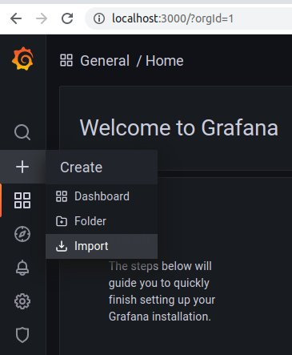
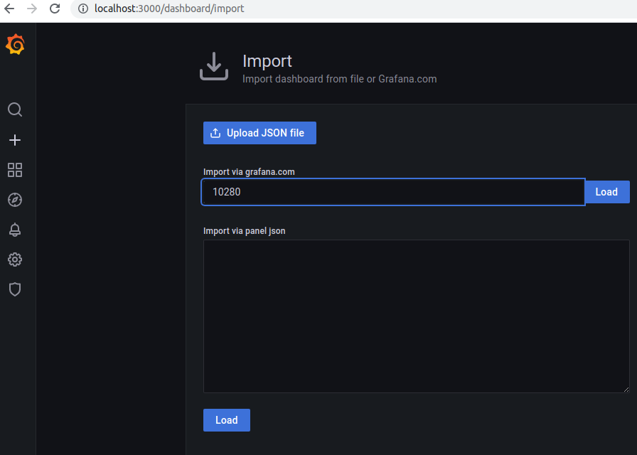

# Spring boot JPA + Oracle XE running in a container

This is a sample project using JPA against an Oracle DB (the Express Edition XE which can be used for testing). First,
we need to have an Oracle DB installed and available, if you don't have one follow the instructions on next step,
otherwise skip it. Testing in the same database that runs in production helps find problems that would otherwise only be
found when deploying in production, for instance in this application, class `Phone` does have a field `phoneNumber`
which cannot be named `number`, as it is
an [Oracle reserved keyword](https://docs.oracle.com/cd/A97630_01/appdev.920/a42525/apb.htm).

This application encodes a REST service (defined in `StudentController.java`) with several endpoints that can be
accessed through GET, DELETE and POST Http methods. There are several Cucumber test scenarios for the REST service in
`student_registration_and_deletion.feature`.

Some of these endpoints can also be accessed via messaging, and are tested
in `student_registration_and_deletion.feature`
using RabbitMQ testcontainers or Spring Integration API.

The following schema summarizes the relationships between `@Entity` classes in this
project 

## Pre-requisites (if you don't have access to an Oracle DB)

We will be using Oracle XE in a Docker container, which you can install through the following steps:

* Install [Docker](https://www.docker.com/get-started)

* Clone Oracle docker-images GitHub repository:

`git clone git@github.com:oracle/docker-images.git`

* enter into this folder

`OracleDatabase/SingleInstance/dockerfiles`

* We'll be building a docker container for Oracle DB version 18.4.0 XE. Run the following script:

`./buildContainerImage.sh -v 18.4.0 -x`

* Create a docker volume so that data in the DB is not lost after restarting the container:

`docker volume create oracle18.4.0XE`

We will link this volume (a folder in your filesystem) to a specific folder within the container. You can check where is
the volume in your filesystem with this command `docker volume inspect oracle18.4.0XE`, you will see something like:

```
[
    {
        "CreatedAt": "2021-10-01T09:40:52+02:00",
        "Driver": "local",
        "Labels": {},
        "Mountpoint": "/var/lib/docker/volumes/oracle18.4.0XE/_data",
        "Name": "oracle18.4.0XE",
        "Options": {},
        "Scope": "local"
    }
]
```

Next, stop the docker container with `docker stop ora18xe` and copy that the Mountpoint folder and all its contents to a
folder in the project's root named `oracle18.4.0XE`, executing the following command within the project's root folder:
`sudo cp -Rp /var/lib/docker/volumes/oracle18.4.0XE/_data oracle18.4.0XE` (the `-p` will preserve the permissions and
ownership of the files). Now start again the docker container with `docker start ora18xe`.

This will be useful as the project is using [Testcontainers](https://www.testcontainers.org/) to automatically start a
docker container with OracleXE, but we want it to use the data that we currently have instead of going through the slow
initialization every time.

* Run docker image previously built. We will link our port 1521 to the container's port 1521, also link the shared
  directory created in the previous step to the container's /opt/oracle/oradata/ folder.

`docker run -i -t -d --hostname ora18xe --name ora18xe -p 1521:1521 -v oracle18.4.0XE:/opt/oracle/oradata oracle/database:18.4.0-xe`

This will take several minutes (~10 in my laptop) before the DB is ready, meanwhile you can check the logs of the
container.

* Inspect the logs of the docker container and note down the password for SYSTEM user, also the pluggable database
  value (ie. `ora18xe/XEPDB1`). Every time you run the docker container it will create and assign a different password
  to SYS and SYSTEM users, so the DataSource pointing to it might need need to be updated if is using the SYS or SYSTEM
  user.

`docker logs ora18xe -f`

The following message in the logs indicates the database is ready:

```
#########################
DATABASE IS READY TO USE!
#########################
```

## Configure DataSource

* Connect to Oracle to set up a user. You can
  use [Oracle SQL Developer](https://www.oracle.com/database/technologies/appdev/sqldeveloper-landing.html)
  or using your IDE (IntelliJ Idea Database tab allows you to configure DataSource for many databases).

Use the following values to configure a Datasource to access Oracle as SYSTEM user:

```
Host: localhost
SID: XE
User: SYSTEM
Password: (the password noted down from the logs)
URL: jdbc:oracle:thin:@localhost:1521:XE
```

If you use SQL developer, the service name is `XEPDB1` (from the pluggable database value noted down from the logs).

Then execute the following SQL to create user `testuser` with password `testpassword`:

```sql
alter
session set "_ORACLE_SCRIPT"=true;
create
user testuser identified by testpassword
    quota unlimited on users;
grant connect, resource to testuser;
```

After creating the `testuser`, configure a new DataSource to connect to Oracle XE using it. If you want to use a
different username and password, remember to update accordingly the `application.yml` file.

When you have finished you can stop the container and restart it, let's check that the data has survived restarting the
container:
`docker stop ora18xe`
`docker start ora18xe`

## Test the data source

So far we do not have any tables in OracleXE, but we can leverage JPA to create these for us. We can set
the `spring.jpa.hibernate.ddl-auto` property `create` in the file `application.yml`, and run `Application.java` to
create the tables specified in our JPA mapping automatically.

Other values besides `create` are `none`, `update`, `validate`, `create-drop` (
see [this StackOverflow answer](https://stackoverflow.com/a/42147995/923509)), in production `none` or `validate` are a
safer choice than `create`, `update`.

You can check which tables were created executing the following SQL through the DataSource console:

```sql
SELECT table_name
FROM user_tables
ORDER BY table_name;
```

(Oracle DBs does not support `show tables`).

## Data model

## RabbitMQ admin console

http://localhost:15672

## Metrics with Prometheus and Grafana

There are two containers, a Prometheus metrics scraper, and a Grafana one to visualize graphics, that can be started
executing the following command within the project root folder:
`docker-compose up -d`

Next visit Grafana URL `http://localhost:3000` with your browser to configure its Prometheus datasource. Add a
Prometheus datasource, and set HTTP URL to `http://prometheus:9090` and click "Save & Test"


Then, click the `+` on the left menu



and import one dashboard for a Spring boot application whose id is `10280`



You can also visit Prometheus URL `http://localhost:9090`. Several endpoints are available, for instance
`http://localhost:9090/metrics` shows all the metrics scraped by Prometheus (it should match those listed in the
application URL `http://localhost:8080/actuator/prometheus`).

## Keycloak configuration

Authentication for this project is done via [Keycloak](https://www.keycloak.org/). We have added the realm
configuration `keycloak/initialize_keycloak.sh` but this configuration unfortunately does not include any users,
therefore we will need to create users and assign them the different roles.

Keycloak docker container by default comes with an in-memory database, but we will use our oracleXE database to persist
all the keycloak configuration tables and have them readily available.

First we need to create a docker network:

`docker network create keycloak-network`

Then, from root folder of the project, we start an oracle container pointing to the volume inside
folder `oracle18.4.0XE` of this project:

```bash
docker run -d --name ora18xeBDD --net keycloak-network \
-p 1521:1521 \
-p 5500:5500 \
-v $(pwd)/oracle18.4.0XE:/opt/oracle/oradata \
oracle/database:18.4.0-xe
```

In order to not mix our application and keycloak tables, we create a new Oracle keycloak user using a SYSTEM datasource:

```sql
alter
session set "_ORACLE_SCRIPT"=true;
drop
user KEYCLOAK cascade;
create
user keycloak identified by keycloak
    quota unlimited on users;
grant connect, resource to keycloak;
```

you can then create a keycloak user DataSource in the same way you did for users `SYSTEM` and `testuser` before.

In order to configure Keycloak to use our OracleXE DB, we first need
to [download Oracle JDBC driver](https://www.oracle.com/database/technologies/appdev/jdbc-downloads.html), version 18c,
and copy it inside project folder `keycloak`. Make sure the file is named `ojdbc8.jar`.

Next, we start a keycloak container in the same docker network (keycloak-network). It will create all keycloak tables
and initialize a `springjpaoracle` realm within our Oracle XE DB:

```bash
docker run -d -p 8088:8080 --name keycloak --net keycloak-network \
-e JAVA_OPTS_APPEND=-Dkeycloak.profile.feature.upload_scripts=enabled \
-e KEYCLOAK_USER=admin \
-e KEYCLOAK_PASSWORD=admin \
-e KEYCLOAK_IMPORT=/tmp/example-realm.json \
-e DB_VENDOR=oracle \
-e DB_ADDR=ora18xeBDD \
-e DB_PORT=1521 \
-e DB_DATABASE=XE \
-e DB_USER=keycloak \
-e DB_PASSWORD=keycloak \
-v $(pwd)/keycloak/realm-export.json:/tmp/example-realm.json \
-v $(pwd)/keycloak/ojdbc8.jar:/opt/jboss/keycloak/modules/system/layers/base/com/oracle/jdbc/main/driver/ojdbc.jar \
jboss/keycloak
```

Have a look at your local Keycloak visiting `http://localhost:8088` with username `admin` and password `admin` as
configured above.

At this point, we still need to create and configure some roles, users and their passwords inside keycloak. We will do
so by executing the bash script in folder `keycloak/initialize_keycloak.sh`. This script uses Keycloak REST endpoints,
have a look at [Keycloak REST API](https://www.keycloak.org/docs-api/5.0/rest-api/index.html). There is a Postman
collection of queries for the different endpoints [here](https://documenter.getpostman.com/view/7294517/SzmfZHnd).

This script creates 4 users: `nickfury` (with `admin` role), `hulk` (with `teacher`role), and `spidermand` and `antman`
both with `student` role. All four users have the same `test1` password.

## Sonarqube

In order to analyze this project code using Sonarqube, run Sonarqube Docker container from the project's root folder
like this:

```bash
docker run -d --name sonarqube \
    -p 9000:9000 \
    -v $(pwd)/sonarqube:/opt/sonarqube/data \
    sonarqube:8.9.3-community
```

and visit `localhost:9000` with your browser. Log in with username `admin` and password `admin`, and you will be
prompted to change the password. Then **add a project** manually and give it a project key, for
instance `spring-jpa-oracle`. Then you will have to generate a token (we named it `springjpatoken`)
and run an analysis on the project (select `Gradle`). We already added the sonarqube plugin to build.gradle file.
Sonarqube will give you a command like the following command one to run an analysis (the `-Dsonar.login=` value will be
different for you, also the `-Dsonar.projectKey=` if you didn't use the same one):

```bash
./gradlew sonarqube \
  -Dsonar.projectKey=spring-jpa-oracle \
  -Dsonar.host.url=http://localhost:9000 \
  -Dsonar.login=49e208586ac4e1e9ae80674bcba0b7f095516930
```

Edit `build.gradle` file to so that the sonarqube properties have the appropiate values:

```groovy
sonarqube {
    properties {
        property "sonar.sources", "src/test/resources/features,src/main/java"
        property 'sonar.host.url', 'http://localhost:9000'
        property 'sonar.projectKey', 'spring-jpa-oracle'
        property 'sonar.login', '49e208586ac4e1e9ae80674bcba0b7f095516930'
    }
}
```

You can can start a Sonarqube analysis with the following command, which assumes that username `admin` has
password `sonarqube`:

```bash
./gradlew -Dsonar.host.url=http://localhost:9000 \
-Dsonar.login=admin \
-Dsonar.password=sonarqube \
-Dsonar.projectKey=spring-jpa-oracle \
-Dsonar.binaries=build/classes \
sonarqube
```